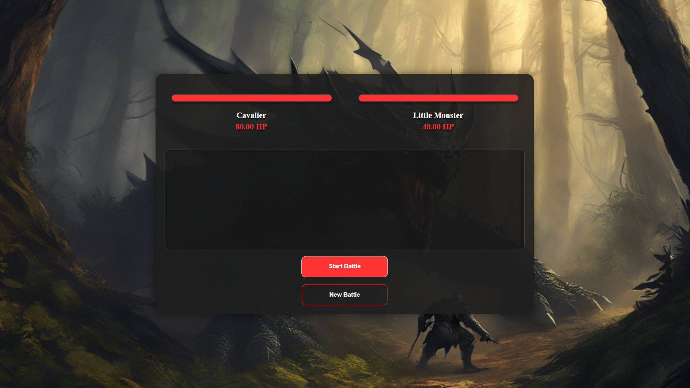

# Battle Game: Simulador de Luta

Este projeto é um jogo simples de luta baseado em personagens, onde dois lutadores (como um cavaleiro e um monstro) se enfrentam em um combate. O jogo utiliza programação orientada a objetos com classes para os personagens e para a mecânica do combate.

## Como Jogar

1. Clique em **Start Battle** para iniciar a batalha.
2. O jogo simula ataques entre os personagens a cada segundo. A batalha vai acontecendo até que um dos lutadores perca toda a sua vida.
3. O log de ações aparecerá à medida que os ataques acontecem.
4. Clique em **New Battle** para reiniciar o combate com personagens novos.

## Tecnologias Usadas

- **HTML5** - Estrutura da página.
- **CSS3** - Estilo visual do jogo e da interface.
- **JavaScript** - Lógica do jogo, com o uso de classes para modelar personagens e o combate.

## Estrutura do Código

- **index.html**: A página principal do jogo, onde o layout e os elementos de interação estão definidos.
- **styles.css**: O estilo visual do jogo, com a definição do layout, cores e animações.
- **script.js**: A lógica de funcionamento do jogo, incluindo a inicialização da batalha e as interações entre os lutadores.
- **classes.js**: As classes que definem os personagens (como `Knight` e `Sorcerer`), o combate e o log das ações.

## Como testar o projeto

- Acesse este link
<a href=https://joaolira-dev.github.io/combat-simulator/>Teste aqui!<a/>

